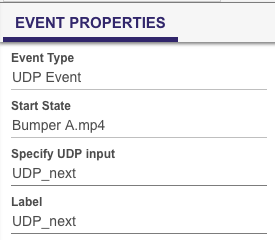

# UDP Control for Brightsign Presentations

## Step 1) Enable UDP and add UDP Ports

## Step 2) Add your content media as usual

## Step 3) Start Adding UDP Event in the Interactive Tab
### We need 4 Total UDP Commands, 5 depending on the usecase.
1. UDP_play
2. UDP_pause
3. UDP_next
4. UDP_prev
5. UDP_presentation OR UDP_ambient (OPTIONAL)

### You can set them here

### Map the Commands to the correct Media Files
1. UDP_play -> Requires an Advanced, we will get into it later
2. UDP_pause -> Requires an Advanced Command, we will get into it later
3. UDP_next -> Drag it to the next media content piece like you would a media end
4. UDP_prev -> Drag it to the previous media content piece like you would a media end, but in reverse
5. UDP_presentation -> Requires Conditional Logic, we will get into it later

### Advanced Commands
1. UDP_Play -> Go to Advanced on the bottom right side and a new command (Video, and Resume)

2. Same goes for UDP_pause
